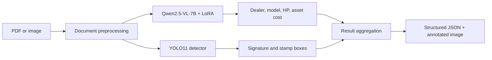

# IDFC GenAI Document Field Extraction

An end-to-end Document AI system that extracts structured information from multilingual tractor invoices and quotations. The solution combines a fine-tuned vision-language model for semantic field extraction with an object detector for signature and stamp localization.

[Live Hugging Face Space](https://huggingface.co/spaces/Neetu143/idfc-genai-extractor) · [Model Artifacts](https://huggingface.co/Neetu143/idfc-genai-extractor-models)

## Project Highlights

- Built a hybrid inference pipeline using **Qwen2.5-VL-7B + LoRA** and **YOLO11**.
- Prepared and annotated a dataset of **495 invoice/quotation documents**, with 395 training and 100 evaluation samples.
- Extracted four semantic fields and detected two visual fields in a single workflow.
- Supported scanned, digital, handwritten, and multilingual documents containing English, Hindi, Gujarati, and Tamil.
- Dockerized and deployed the application as a Hugging Face Space with Gradio.
- Implemented model caching, CPU/disk offloading, serialized inference, and separate large-model artifact storage.

## Extracted Fields

| Field | Output | Method |
|---|---|---|
| Dealer name | Text | Qwen2.5-VL-7B + LoRA |
| Model name | Text | Qwen2.5-VL-7B + LoRA |
| Horsepower | Numeric value | Qwen2.5-VL-7B + LoRA |
| Asset cost | Numeric value | Qwen2.5-VL-7B + LoRA |
| Signature | Presence, confidence, bounding box | YOLO11 |
| Stamp | Presence, confidence, bounding box | YOLO11 |

## Architecture



### Vision-language branch

- **Base model:** `Qwen/Qwen2.5-VL-7B-Instruct`
- **Fine-tuning:** LoRA with rank 64 on attention projection layers
- **Target modules:** `q_proj`, `k_proj`, `v_proj`, and `o_proj`
- **Purpose:** Convert document images into normalized structured fields

### Object-detection branch

- **Model:** YOLO11 using Ultralytics
- **Classes:** Signature and stamp
- **Purpose:** Predict presence, confidence, and bounding-box coordinates
- **Observed performance:** Approximately 90% mAP50 during project evaluation

## Dataset and Evaluation

The dataset contains tractor invoices and quotations with varied layouts, scan quality, languages, handwriting, and vendor formats.

| Dataset property | Value |
|---|---:|
| Total documents | 495 |
| Training documents | 395 |
| Evaluation documents | 100 |
| Signature present | 93% |
| Stamp present | 94% |
| Both present | 89% |

### Evaluation rules

| Field | Matching rule |
|---|---|
| Dealer name | Fuzzy similarity ≥ 90% |
| Model name | Fuzzy similarity ≥ 95% |
| Horsepower | Numeric tolerance ±5% |
| Asset cost | Numeric tolerance ±5% |
| Signature | Presence and IoU ≥ 0.5 |
| Stamp | Presence and IoU ≥ 0.5 |

### Error analysis on 100 evaluation documents

| Field | Error rate |
|---|---:|
| Asset cost | 4% |
| Stamp | 9% |
| Dealer name | 12% |
| Horsepower | 13% |
| Signature | 23% |
| Model name | 59% |

Model-name extraction was the primary challenge because of inconsistent naming, abbreviations, handwritten text, and manufacturer-specific formatting. Signature errors were mainly associated with faint strokes, partial signatures, and overlap with stamps.

## Example Output

```json
{
  "fields": {
    "dealer_name": "SRI AMUTHAM TRACTORS",
    "model_name": "SONALIKA TIGER 55-4WD",
    "horse_power": 55,
    "asset_cost": 1200000,
    "signature": {
      "present": true,
      "bbox": [245.5, 890.2, 412.8, 975.6],
      "conf": 0.92
    },
    "stamp": {
      "present": true,
      "bbox": [520.1, 850.3, 720.5, 1020.8],
      "conf": 0.88
    }
  },
  "processing_time_sec": 5.21
}
```

## Technology Stack

- **Languages:** Python
- **ML:** PyTorch, Hugging Face Transformers, PEFT, Accelerate, Ultralytics YOLO
- **Document processing:** Pillow, PyMuPDF, pdf2image
- **Application:** Gradio
- **Deployment:** Docker, Hugging Face Spaces, Hugging Face Hub
- **Annotation and analysis:** LabelMe, OCR-assisted labeling, Matplotlib

## Running Locally

### Requirements

- Python 3.10+
- Approximately 20 GB of model storage
- CUDA-capable GPU recommended for practical inference speed
- Poppler for PDF conversion

### Setup

```bash
git clone <repository-url>
cd idfc_genai
pip install -r requirements.txt

huggingface-cli download Qwen/Qwen2.5-VL-7B-Instruct \
  --local-dir models/qwen2.5-vl-7b-instruct
```

### Command-line inference

```bash
python executable.py invoice.pdf --output result.json
```

### Gradio application

```bash
python app.py
```

The local interface opens at `http://localhost:7860`.

## Hugging Face Deployment

Deployment-specific files are maintained under [`hf_space/`](hf_space/):

- Docker-based Gradio Space
- Base-model and trained-weight downloads from Hugging Face Hub
- Persistent cache support under `/storage/models`
- Disk offloading under `/storage/offload`
- Separate model repository for the LoRA adapter and YOLO checkpoint

The 7B model is technically deployable with disk offloading on a 16 GB CPU Space, but inference on two CPU cores is too slow for a production user experience. A GPU Space or a CPU instance with at least 32 GB RAM is recommended.

## Repository Structure

```text
idfc_genai/
├── app.py                       # Local Gradio application
├── executable.py                # Command-line inference
├── evaluate.py                  # Evaluation pipeline
├── vlm_lora_train.py            # VLM LoRA training
├── train_*.py                   # Detection and field-model training
├── prepare_vlm_jsonl.py         # VLM dataset preparation
├── annotations/                 # Document annotations
├── eda_output/                  # Dataset and error-analysis plots
├── sample_output/               # Example predictions
└── hf_space/                    # Hugging Face deployment package
```

## Key Engineering Lessons

- Hybrid architectures can separate semantic extraction from spatial detection more effectively than forcing one model to solve both tasks.
- Document model evaluation needs field-specific matching rules rather than a single exact-match metric.
- Large VLM deployment is constrained by memory bandwidth and compute, not only model storage.
- LoRA reduces training and artifact size, but the full base model is still required during inference.

## Team

Developed for **Convolve 4.0 – IDFC GenAI Hackathon 2024**.
